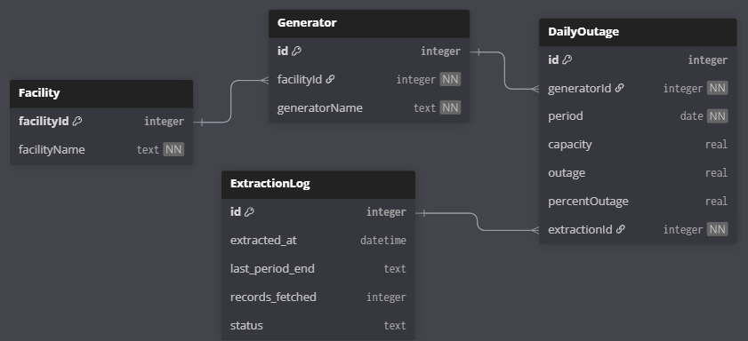
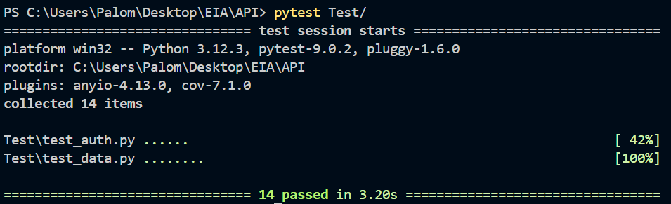
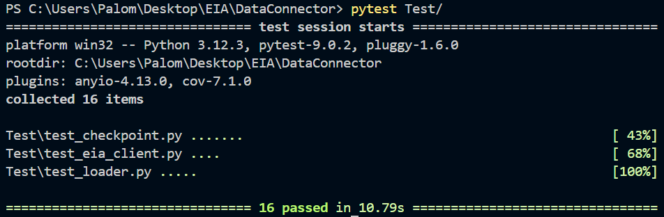

# EIA Nuclear Outages Data Pipeline

---

## Descripción general

Este proyecto automatiza la recolección y visualización de registros diarios de interrupciones de generadores nucleares en Estados Unidos. Los datos provienen de la API de la EIA (Administración de Información Energética de EE.UU.), se procesan a través de un pipeline por etapas y se sirven mediante un backend en FastAPI hacia un frontend en React/Next.js.

Capacidades principales:

- Extracción incremental con recuperación por checkpoint — reinicia desde la última fecha exitosa en caso de fallo
- Ingesta por chunks de 3 meses para manejar rangos históricos grandes (2007 → presente)
- API REST autenticada con JWT y refresh deslizante de tokens
- 30 pruebas pasando en los módulos de API y DataConnector

---

## Stack tecnológico

| Capa              | Tecnología                            |
|-------------------|---------------------------------------|
| Fuente de datos   | EIA Open Data API                     |
| Pipeline          | Python, pandas, pyarrow               |
| Almacenamiento    | SQLite, Parquet                       |
| Backend           | FastAPI, SQLAlchemy, passlib, JWT     |
| Frontend          | Next.js 16, React, Tailwind CSS       |
| Contenedorización | Docker, Docker Compose                |
| Pruebas           | pytest (30 pruebas)     |

## Arquitectura

```
┌─────────────────────────────────────────────────────┐
│                  docker-compose                      │
│                                                      │
│  ┌─────────────────────────────┐   ┌──────────────┐ │
│  │         backend             │   │   frontend   │ │
│  │                             │   │              │ │
│  │  ┌──────────────────────┐   │   │  Next.js     │ │
│  │  │   FastAPI  :8000     │◄──┼───│  React       │ │
│  │  │   Auth / Data /      │   │   │  :3000       │ │
│  │  │   Refresh endpoints  │   │   └──────────────┘ │
│  │  └──────────┬───────────┘   │                    │
│  │             │ importlib     │                    │
│  │  ┌──────────▼───────────┐   │                    │
│  │  │   DataConnector      │   │                    │
│  │  │   EIA API → Parquet  │   │                    │
│  │  │   → SQLite           │◄──┼── volumen:         │
│  │  └──────────────────────┘   │   sqlite_data      │
│  └─────────────────────────────┘                    │
└─────────────────────────────────────────────────────┘
                        │
                  api.eia.gov
```


---

## Esquema de base de datos



La base de datos está compuesta por cuatro tablas:

- **Facility** — identidad de la planta nuclear (`facilityId`, `facilityName`)
- **Generator** — generadores individuales dentro de una planta, vinculados por `facilityId`
- **DailyOutage** — métricas diarias de capacidad e interrupción por generador (`capacity`, `outage`, `percentOutage`)
- **ExtractionLog** — registro de auditoría de cada ejecución del pipeline, incluyendo `status`, `records_fetched` y `last_period_end`

---

## Inicio rápido
 
### Prerrequisitos
 
- [Docker Desktop](https://www.docker.com/products/docker-desktop/) instalado y corriendo
- Una API key de la EIA ([registro gratuito](https://www.eia.gov/opendata/register.php))
 
### 1. Clonar el repositorio
 
```bash
git clone https://github.com/tu-usuario/EIA-Nuclear-Outages-Data-Pipeline.git
cd EIA-Nuclear-Outages-Data-Pipeline
```
 
### 2. Configurar variables de entorno
Edita el `.env` con tus valores 
```bash
# ── API Config ─────────────────────────────────────────────
# Regístrate para obtener una API key gratuita en:
# https://www.eia.gov/opendata/register.php
# Recibirás la key por correo en pocos minutos
API_KEY=
LENGTH=
BASE_URL=

# ── JWT ───────────────────────────────────────────────────
JWT_SECRET=
JWT_ALGORITHM=HS256
JWT_EXPIRE_MINUTES=5

# ── App credentials ───────────────────────────────────────
# Genera el hash con:
# python -c "from passlib.context import CryptContext; print(CryptContext(schemes=['bcrypt']).hash('tu_contraseña'))"
APP_USERNAME=admin@eia.com
APP_PASSWORD=password_hash_aquí

# ── CORS ──────────────────────────────────────────────────
ALLOWED_ORIGINS=["http://localhost:3000"]
```

### 3. Construir y levantar
 
```bash
docker compose up --build
```
 


### 4. Acceder a la aplicación

| Servicio  | URL                        |
|-----------|----------------------------|
| Frontend  | http://localhost:3000      |
| Docs API  | http://localhost:8000/docs |

---


---
 
## Ejemplos de resultados
 
### Suite de pruebas — API (14 pruebas)

Se cubren los flujos de autenticación y consulta de datos. Todas las pruebas corren contra un cliente de prueba sin levantar el servidor.


 
### Suite de pruebas — DataConnector (16 pruebas)

Se valida el comportamiento del checkpoint, el cliente de la EIA ante fallos de red y timeouts. Las pruebas de red usan mocks para no depender de la API real.
 

 

---

## Supuestos

- **Autenticación de un solo usuario** — la app utiliza una credencial de administrador única definida via variables de entorno. La autenticación multi-usuario quedó fuera del alcance. 
| Campo      | Valor                        |
|------------|---------------|
| Usuario    | admin@eia.com |
| Contraseña | 123Adm#       |

- **Disponibilidad de datos EIA** — el pipeline asume que el endpoint de interrupciones de generadores nucleares de la EIA permanece disponible en la URL configurada.ersisten en Parquet antes de cargarse en SQLite, permitiendo re-ingesta sin volver a consultar la API.

---

